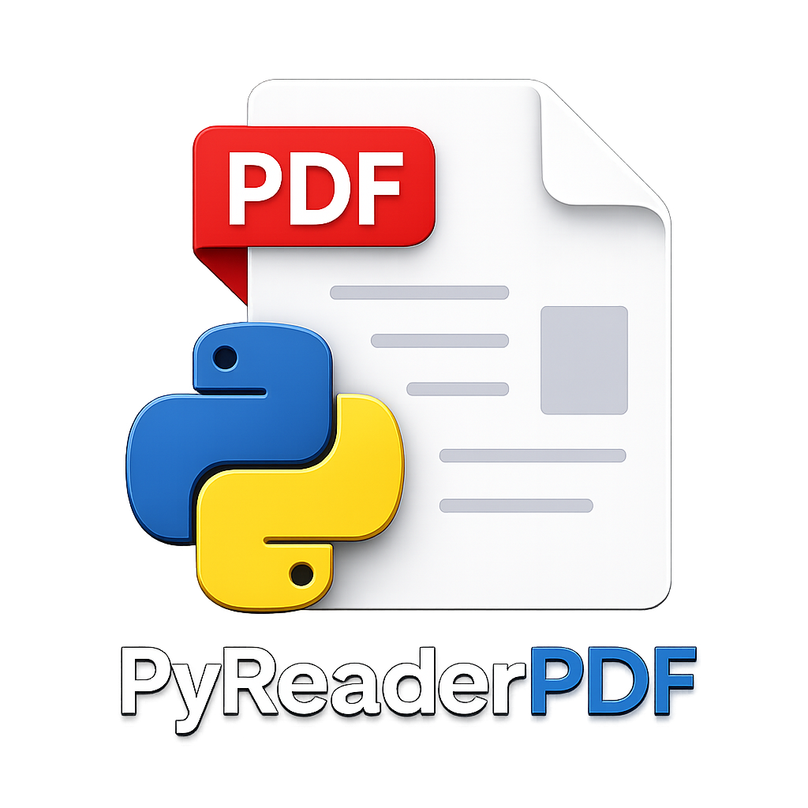

<p align="center">
  
</p>

<h1 align="center">PyReaderPDF</h1>

<p align="center">
  Leitor de PDF para desktop com interface Fluent Design, construído com Python, PySide6 e PyMuPDF.
</p>

---

## Funcionalidades

### Biblioteca
- **Biblioteca pessoal** — adicione PDFs com miniaturas geradas automaticamente
- **Reordenação por arrastar** — arraste cards para reorganizar a biblioteca; borda azul indica o alvo e cursor de mão confirma a ação
- **Histórico de recentes** — acesso rápido aos últimos arquivos abertos
- **Busca na biblioteca** — filtre por nome ou caminho

### Leitura
- **Modos de visualização** — página única ou rolagem contínua com lazy loading
- **Progresso automático** — reabre cada PDF na última página lida
- **Zoom** — suavizado, com suporte a HiDPI e telas de alta resolução
- **Abas com arrastar e soltar** — reordene abas arrastando, abra múltiplos PDFs simultaneamente

### Split View
- **Dois PDFs lado a lado** — abra via atalho ou arrastando uma aba
- **Navegação independente** — cada painel navega, faz zoom e rola de forma independente

### Seleção de texto e marca-texto
- **Seleção por arrasto** — selecione texto arrastando o cursor; seleção segue a ordem de leitura
- **Barra flutuante de ações** — aparece sobre a seleção com paleta de cores para marca-texto e botão de adicionar nota
- **Marca-texto colorido** — aplique destaques persistentes em múltiplas cores
- **Remover marca-texto** — clique sobre qualquer highlight para removê-lo

### Anotações
- **Painel de notas lateral** — salve citações e observações por página em cada PDF
- **Notas vinculadas à seleção** — crie notas diretamente da barra flutuante ao selecionar texto

---

## Requisitos

- Python 3.10+
- [PyMuPDF](https://pymupdf.readthedocs.io/)
- [PySide6](https://doc.qt.io/qtforpython/)
- [PyQt-Fluent-Widgets](https://github.com/zhiyiYo/PyQt-Fluent-Widgets) (`qfluentwidgets`)

## Instalação

```bash
git clone https://github.com/seu-usuario/pyreader-pdf.git
cd pyreader-pdf
pip install -r requirements.txt
python main.py
```

> O `requirements.txt` não inclui `qfluentwidgets`. Instale separadamente:
> ```bash
> pip install PyQt-Fluent-Widgets[Full]
> ```

---

## Atalhos de teclado

| Atalho | Ação |
|---|---|
| `Ctrl+O` | Abrir PDF |
| `Ctrl+W` | Fechar aba / sair do Split View |
| `Ctrl+D` | Duplicar aba atual |
| `Ctrl+→` | Split View com aba ativa à esquerda |
| `Ctrl+←` | Split View com aba ativa à direita |
| `Esc` | Fechar Split View |

---

## Arquivos de dados

| Arquivo/Pasta | Conteúdo |
|---|---|
| `~/.pyreaderpdf_library.json` | Lista da biblioteca com miniaturas |
| `~/.pyreaderpdf_config.json` | Configurações (zoom padrão, modo de visualização) |
| `~/.pyreaderpdf/progress.json` | Última página lida por PDF |
| `~/.pyreaderpdf_notes/` | Anotações por PDF (um arquivo JSON por livro) |
| `~/.pyreaderpdf/highlights/` | Marca-textos por PDF |

---

## Tecnologias

- **[PySide6](https://doc.qt.io/qtforpython/)** — framework de interface gráfica
- **[PyMuPDF](https://pymupdf.readthedocs.io/)** — renderização e extração de texto de PDFs
- **[PyQt-Fluent-Widgets](https://github.com/zhiyiYo/PyQt-Fluent-Widgets)** — componentes Fluent Design
- **[Pillow](https://pillow.readthedocs.io/)** — geração de miniaturas
